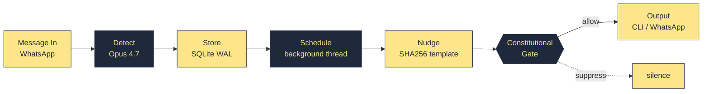
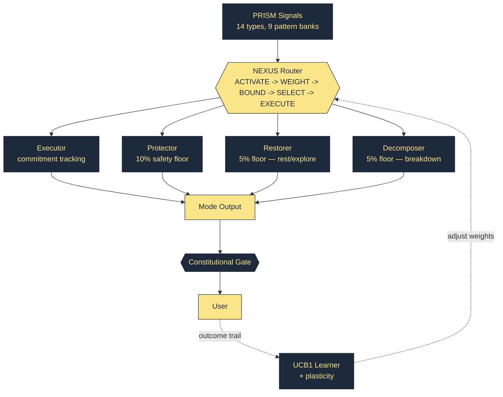
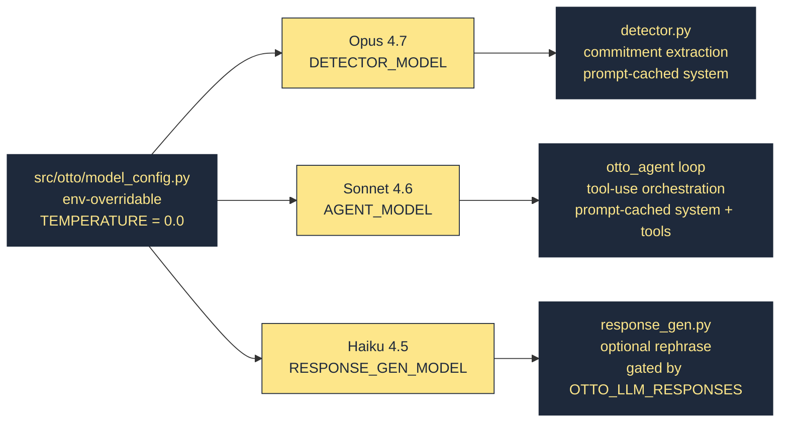

# OTTO

OTTO watches your WhatsApp messages.
When you make a commitment ("I'll send that Monday"), OTTO remembers.
When you haven't followed through, OTTO asks — without judgment.

**"Manage the noise without falling into it."**

## Quick Start

```bash
cd otto_v4
pip install -e ".[dev]"
otto list
```

## Commands

```
otto list                 Show active commitments
otto list --all           Show all including done/parked
otto list --due           Show only overdue
otto add "text"           Manually add a commitment
otto done <id>            Mark commitment as done
otto park <id>            Park a commitment (guilt-free)
otto nudge                Run follow-up check now
otto stats                Counts and follow-through stats
otto metrics              Mode learning + plasticity visibility
otto watch                Start WhatsApp webhook server
otto nuke                 Delete ALL data. Fresh start.
```

## Architecture

### Core loop



The **constitutional layer sits above all output.** Any nudge or action can be suppressed based on cognitive state — that is the product differentiator. OTTO can decide *not* to remind you.

### Mode routing (NEXUS, 5-phase deterministic)



Same signals + same state = same routing. No randomness in control flow. UCB1 learning is contextual but **deterministic given the trail history** — application-level determinism per Patent P1.

### LLM integration (Tier 1 — Opus 4.7 upgrade)



Every model surface is one env var away from rollback:

```powershell
$env:OTTO_DETECTOR_MODEL = "claude-sonnet-4-5-20250929"   # rollback example
```

## How It Works

- **Input:** WhatsApp Cloud API webhooks via FastAPI (`watcher.py`)
- **Detection:** Claude Opus 4.7 extracts commitments — nuance on "I'll try" vs "I will" drives confidence and nudge timing
- **Storage:** SQLite WAL (`~/.otto/commitments.db`), shared connection pool (`db.py`), Fernet-encrypted sensitive fields (`crypto.py`)
- **Follow-up:** Deterministic SHA256 template selection, 24h cooldown, zero LLM cost on the hot path
- **Routing:** PRISM signals (regex banks) -> NEXUS 5-phase router -> 4 modes -> Constitutional Gate
- **Learning:** UCB1 mode-weight learning with plasticity amplification during crisis (`learner.py`)
- **Agent:** Same logic, different surface — tool-use loop with 10 MCP tools, pre-tool-use constitutional hooks
- **Interface:** Click CLI + optional WhatsApp Cloud API outbound

## Constitutional Principles (Immutable)

1. **Safety First** — Protector has a 10% floor and can suppress any output
2. **Don't Become Noise** — backs off when nudges aren't leading to completions
3. **User Knows Best** — "Park it" is a first-class action, not failure
4. **Rest Is Productive** — can grant permission to stop
5. **One At A Time** — when overwhelmed, reduce to ONE choice
6. **Dignity Always** — no clinical labels, no "ADHD mode"
7. **Privacy Is Sovereignty** — all data local, no cloud sync

## Tests

```bash
cd otto_v4
python -m pytest tests/ -v -m "not integration"           # 589 core tests
python -m pytest otto_agent/tests/ -v                     # 56 agent tests
python -m pytest tests/ otto_agent/tests/ -v              # 645 total (needs ANTHROPIC_API_KEY for integration)
```

## License

MIT
