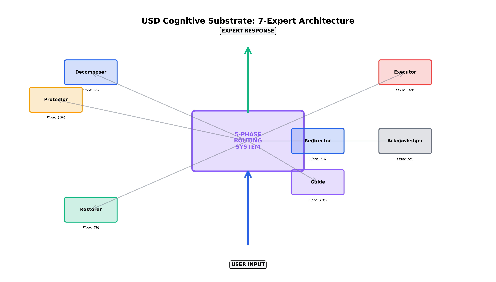
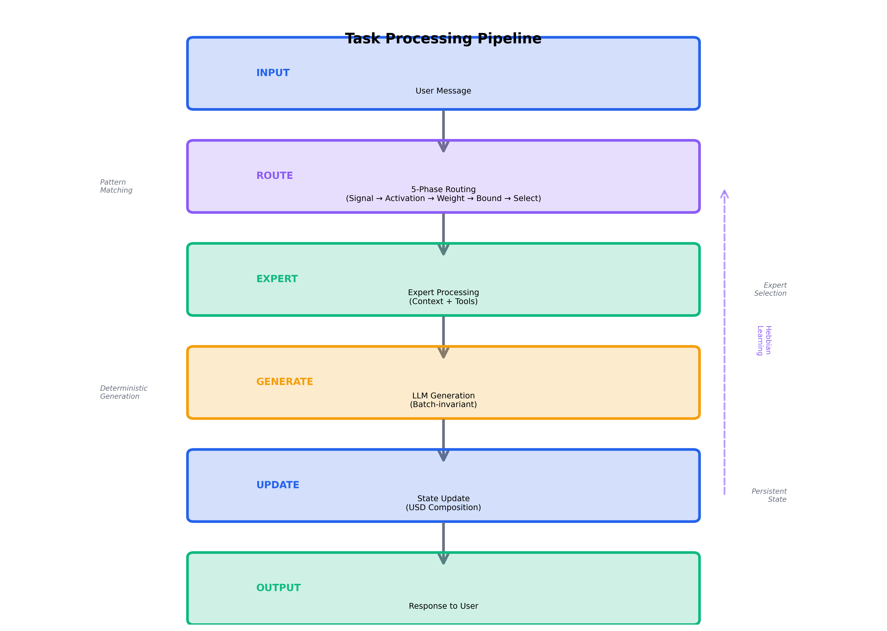
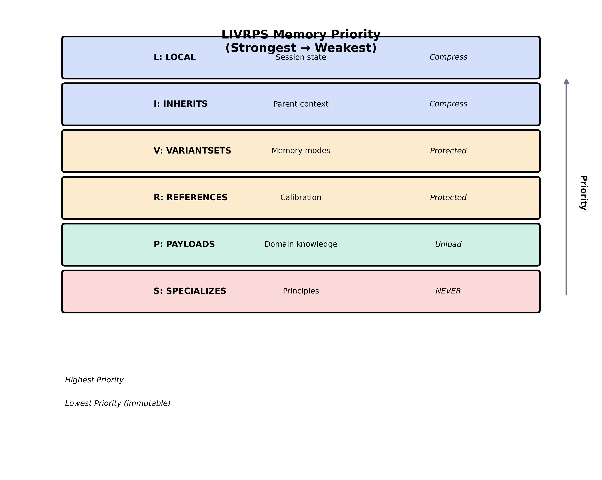

# Architecture

**Technical deep-dive into Otto's cognitive ottotion system.**

Based on ThinkingMachines [He2025] batch-invariance and USD composition semantics.

> **Reference:** He, Horace and Thinking Machines Lab, "Defeating Nondeterminism in LLM Inference",
> Thinking Machines Lab: Connectionism, Sep 2025.
> https://thinkingmachines.ai/blog/defeating-nondeterminism-in-llm-inference/

## Overview

Otto v5.0 is a cognitive ottotion system that applies USD (Universal Scene Description) composition semantics to cognitive state management, with ThinkingMachines-compliant deterministic execution.

## Core Design Principles

### 1. USD as Universal State Description

Pixar's USD was designed to resolve conflicting opinions in complex 3D pipelines. We apply the same composition semantics to AI agent ottotion:

```
USD Concept          → Cognitive Application
─────────────────────────────────────────────
Scene graph          → Cognitive architecture
Prim attributes      → Behavioral parameters
Composition arcs     → Priority resolution
Variants             → Mode switching
Layers               → Cognitive subsystems
Payloads             → Domain knowledge
```

### 2. LIVRPS Priority Resolution

Memory and state conflicts resolve using LIVRPS priority (strongest to weakest):

```
Layer        Priority  Description                 Compressible
────────────────────────────────────────────────────────────────
LOCAL           6      Session state               Yes (first)
INHERITS        5      Parent task context         Yes (second)
VARIANTSETS     4      Memory modes                No
REFERENCES      3      Cross-session calibration   No
PAYLOADS        2      Domain knowledge            Unload only
SPECIALIZES     1      Principles (constitutional) NEVER
```

### 3. Deterministic Routing

All routing decisions are deterministic via hash-based selection:

```python
expert_index = int(hashlib.md5(task.encode()).hexdigest(), 16) % len(experts)
```

Same input → Same routing → Same output.

## System Architecture



*Figure: USD Cognitive Substrate architecture showing the central 5-phase routing system connected to seven specialized experts. Each expert has a safety floor (minimum activation weight) to ensure critical capabilities remain available.*

<details>
<summary>ASCII Architecture (text fallback)</summary>

```
┌─────────────────────────────────────────────────────────────────────────┐
│                              Otto                                   │
│                                                                          │
│  ┌─────────────────────────────────────────────────────────────────┐   │
│  │                        Task Router                               │   │
│  │  Analyzes task → Activates relevant agents → Manages execution  │   │
│  └─────────────────────────────────────────────────────────────────┘   │
│                                    │                                     │
│            ┌───────────────────────┼───────────────────────┐            │
│            ▼                       ▼                       ▼            │
│  ┌──────────────────┐   ┌──────────────────┐   ┌──────────────────┐   │
│  │   ECHO Curator   │   │     Domain       │   │    MoE Router    │   │
│  │                  │   │   Intelligence   │   │                  │   │
│  │  Memory (LIVRPS) │   │  (Phoenix+PRISM) │   │  Expert Select   │   │
│  └──────────────────┘   └──────────────────┘   └──────────────────┘   │
│            │                       │                       │            │
│            └───────────────────────┼───────────────────────┘            │
│                                    ▼                                     │
│  ┌──────────────────┐   ┌──────────────────┐   ┌──────────────────┐   │
│  │  World Modeler   │   │  Code Generator  │   │   Determinism    │   │
│  │                  │   │                  │   │     Guard        │   │
│  │  Context Graph   │   │   NEXUS Output   │   │  Batch=1 Check   │   │
│  └──────────────────┘   └──────────────────┘   └──────────────────┘   │
│                                    │                                     │
│                                    ▼                                     │
│                       ┌──────────────────┐                              │
│                       │  Self Reflector  │                              │
│                       │    (RC^+xi)      │                              │
│                       │  Convergence     │                              │
│                       └──────────────────┘                              │
│                                                                          │
└─────────────────────────────────────────────────────────────────────────┘
```
</details>

## Data Flow

### 5-Phase NEXUS Pipeline (ThinkingMachines Compliant)

```
┌─────────────┐     ┌─────────────┐     ┌─────────────┐
│   DETECT    │ ──▶ │   CASCADE   │ ──▶ │    LOCK     │
│   (PRISM)   │     │  (ADHD_MoE) │     │   (MAX3)    │
└─────────────┘     └─────────────┘     └─────────────┘
                                               │
┌─────────────┐     ┌─────────────┐            │
│   UPDATE    │ ◀── │   EXECUTE   │ ◀──────────┘
│  (RC^+xi)   │     │  (Claude)   │
└─────────────┘     └─────────────┘

1. DETECT    → PRISM extracts signals (emotional > mode > domain > task)
2. CASCADE   → Safety gates + ADHD_MoE routing (7 experts, fixed priority)
3. LOCK      → MAX3 bounded reflection + parameter freezing
4. EXECUTE   → Generation with locked parameters
5. UPDATE    → RC^+xi convergence tracking (xi_n = ||A_{n+1} - A_n||_2)
```

### ThinkingMachines [He2025] Compliance

| Guarantee | Implementation |
|-----------|----------------|
| Fixed evaluation order | `SIGNAL_PRIORITY`, `EXPERT_PRIORITY` immutable lists |
| No dynamic switching | First-match-wins, no runtime reordering |
| Parameter locking | `LockedParams` immutable dataclass |
| Reproducible checksums | `json.dumps(..., sort_keys=True)` + MD5 |
| Atomic state commits | `batch_update()` pattern |
| Session invariance | Snapshot before processing |

### Task Processing Pipeline



*Figure: End-to-end task processing pipeline showing six stages from user input to response. The 5-phase routing system determines expert selection, which then processes the task with appropriate context and tools. Average routing latency: 0.13ms per decision.*

<details>
<summary>ASCII Pipeline (text fallback)</summary>

```
Input Task
    │
    ▼
┌─────────────────────┐
│   Task Analysis     │
│  (keyword matching) │
└─────────────────────┘
    │
    ▼
┌─────────────────────┐
│   Agent Selection   │
│  (always: echo,     │
│   determinism)      │
└─────────────────────┘
    │
    ▼
┌─────────────────────┐
│  Parallel Execution │
│  (max 3 concurrent) │
└─────────────────────┘
    │
    ▼
┌─────────────────────┐
│  Result Aggregation │
│  (with checksums)   │
└─────────────────────┘
    │
    ▼
Output
```
</details>

## Memory Architecture (ECHO Curator)

### LIVRPS Memory Layers



*Figure: LIVRPS memory hierarchy showing six layers from highest to lowest priority. LOCAL (session state) has highest priority, while SPECIALIZES (principles) has lowest priority but is immutable. Compression policies vary by layer to optimize context usage.*

**Layer Policies:**
- **LOCAL** (Session state): Compress aggressively, reset between sessions
- **INHERITS** (Parent context): Compress, inherit from higher layers
- **VARIANTSETS** (Memory modes): Protected, switch between named modes
- **REFERENCES** (Calibration): Protected, external reference data
- **PAYLOADS** (Domain knowledge): Can be unloaded for memory management
- **SPECIALIZES** (Principles): **NEVER** compressed or modified (immutable)

```python
memory_layers = {
    "specializes": {},   # Principles - NEVER compressed
    "payloads": {},      # Domain knowledge - unloadable
    "references": {},    # Calibration - protected
    "variantsets": {},   # Memory modes - protected
    "inherits": {},      # Parent context - compressible
    "local": {}          # Session state - compresses first
}
```

### Memory Modes

| Mode | Search Depth | Search Breadth | Use When |
|------|--------------|----------------|----------|
| `focused_recall` | Deep | Narrow | Debugging, implementation |
| `exploratory_recall` | Shallow | Wide | Brainstorming, research |
| `recovery_recall` | Principles only | Minimal | Burnout, error states |

### Compression Order

When memory pressure occurs:
1. Compress LOCAL (session state)
2. Compress INHERITS (parent context)
3. Unload PAYLOADS (domain knowledge)
4. NEVER compress: VARIANTSETS, REFERENCES, SPECIALIZES

## Domain Intelligence (Phoenix + PRISM)

### Multi-Perspective Analysis

PRISM applies 6 perspectives to each task:
- **Causal**: What causes what?
- **Optimization**: Where are the bottlenecks?
- **Hierarchical**: What's the structure?
- **Temporal**: What's the sequence?
- **Risk**: What could go wrong?
- **Opportunity**: What's possible?

### Domain Routing

```
Task Input
    │
    ▼
┌─────────────────────┐
│  Keyword Matching   │
│  (against domains)  │
└─────────────────────┘
    │
    ├── Match found → Route to specific domain + specialist
    │
    └── No match → Run ALL domains (general fallback)
```

## Expert Selection (MoE Router)

### Hash-Based Determinism

```python
# Same task always selects same expert
expert_hash = hashlib.md5(task.encode()).hexdigest()
expert_index = int(expert_hash, 16) % len(available_experts)
selected_expert = available_experts[expert_index]
```

### Expert Types

```
Expert              Specialization
──────────────────────────────────────────
systems_architect   Architecture, design
code_implementer    Implementation, fixes
debug_detective     Error analysis
researcher          Deep exploration
optimizer           Performance tuning
```

## Determinism Guard

### The Critical Fix

```python
# Batch size 1 is the key to reproducibility
torch.backends.cudnn.benchmark = False
torch.backends.cudnn.deterministic = True
batch_size = 1  # Critical
```

### Checksum Generation

Every agent output includes a checksum for verification:

```python
content_hash = hashlib.md5(
    json.dumps(output, sort_keys=True).encode()
).hexdigest()[:16]
```

## Filesystem State (Ralph Pattern)

```
ottotor_workspace/
├── tasks/              # Task definitions (input)
│   └── task_001.json
├── results/            # Agent outputs (with checksums)
│   ├── echo_curator.json
│   ├── domain_intelligence.json
│   └── ...
└── checkpoints/        # Recovery points
```

The filesystem IS the state. No hidden state, no surprise mutations.

## Constraints

### Ottotion Limits
- Max parallel agents: 3
- Max chain depth: 3
- Max exchanges per agent: 10

### Anti-Ottotion Signals

Do NOT spawn agents when:
- Single-file, single-step task
- User in flow state
- burnout >= ORANGE
- energy = depleted
- Task is a simple query

## Error Handling

### Recovery Protocol

```
1. Error detected
    │
    ▼
2. Consult SPECIALIZES (principles) layer
    │
    ▼
3. Log error with context
    │
    ▼
4. Offer recovery options to user
```

### Principle Consultation

When uncertainty > 0.7 or conflicting signals detected, consult principles in this order:
1. Constitutional constraints
2. Calibration data
3. Current context

## Extension Points

### Adding New Domains

Create `~/.framework-ottotor/domains/your_domain.json`:

```json
{
  "name": "Your Domain",
  "specialists": {
    "specialist_name": {
      "keywords": ["trigger", "words"],
      "analysis_focus": ["what", "to", "analyze"]
    }
  },
  "routing_keywords": ["domain", "triggers"]
}
```

### Adding New Agents

Extend `BaseAgent`:

```python
class YourAgent(BaseAgent):
    def __init__(self):
        super().__init__(
            name="your_agent",
            framework="Your Framework",
            ces_alignment="What it does"
        )

    async def execute(self, task: str, context: Dict) -> Dict:
        # Implementation
        return {"output": result}
```
