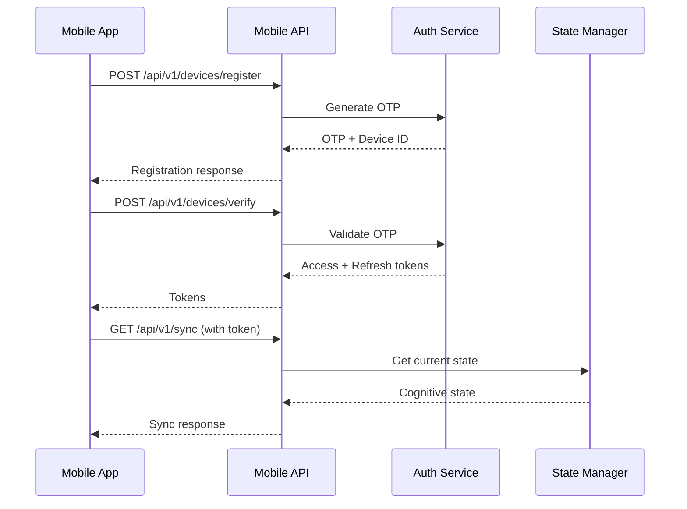

# Mobile API Reference

The OTTO Mobile API provides a comprehensive REST interface for mobile applications (iOS, Android, Web).

## Overview



## Base URL

```
https://api.otto-os.io/api/v1
```

## Authentication

OTTO uses a device-based authentication flow:

1. **Device Registration** - Register device, receive OTP
2. **Device Verification** - Verify OTP, receive tokens
3. **Token Usage** - Include access token in Authorization header
4. **Token Refresh** - Use refresh token when access token expires

### Headers

```http
Authorization: Bearer <access_token>
X-Device-ID: <device_id>
Content-Type: application/json
```

## Endpoints

### Device Management

#### Register Device

```http
POST /api/v1/devices/register
```

Register a new device for push notifications and sync.

**Request Body:**

```json
{
  "device_type": "ios",
  "device_name": "iPhone 15 Pro",
  "os_version": "17.0",
  "app_version": "1.0.0"
}
```

**Response:**

```json
{
  "device_id": "dev_abc123",
  "otp": "123456",
  "expires_at": "2024-01-15T12:00:00Z"
}
```

| Field | Type | Description |
|-------|------|-------------|
| `device_type` | string | `ios`, `android`, `web` |
| `device_name` | string | Human-readable device name |
| `os_version` | string | Operating system version |
| `app_version` | string | Application version |

---

#### Verify Device

```http
POST /api/v1/devices/verify
```

Verify device with OTP and associate with user.

**Request Body:**

```json
{
  "device_id": "dev_abc123",
  "otp": "123456",
  "user_id": "user_xyz789"
}
```

**Response:**

```json
{
  "success": true,
  "access_token": "eyJ...",
  "refresh_token": "eyJ...",
  "expires_in": 3600
}
```

---

#### Refresh Token

```http
POST /api/v1/auth/refresh
```

Refresh an expired access token.

**Request Body:**

```json
{
  "refresh_token": "eyJ..."
}
```

**Response:**

```json
{
  "success": true,
  "access_token": "eyJ...",
  "expires_in": 3600
}
```

---

### State Synchronization

#### Get Sync State

```http
GET /api/v1/sync/{device_id}
```

Get current cognitive state for synchronization.

**Response:**

```json
{
  "version": 42,
  "cognitive_state": {
    "active_mode": "focused",
    "burnout_level": "GREEN",
    "energy_level": "high",
    "momentum_phase": "rolling",
    "current_altitude": "15000ft"
  },
  "projects": [
    {
      "id": "proj_123",
      "name": "OTTO OS",
      "status": "FOCUS"
    }
  ],
  "last_updated": "2024-01-15T12:00:00Z"
}
```

---

### Push Notifications

#### Register Push Token

```http
POST /api/v1/push/register
```

Register a push notification token.

**Request Body:**

```json
{
  "device_id": "dev_abc123",
  "push_token": "fcm_token_here",
  "provider": "fcm"
}
```

| Provider | Description |
|----------|-------------|
| `apns` | Apple Push Notification Service |
| `fcm` | Firebase Cloud Messaging |
| `matrix` | Matrix Push Gateway |
| `unified` | UnifiedPush |

**Response:**

```json
{
  "success": true,
  "token_id": "tok_abc123"
}
```

---

### Commands

#### Execute Command

```http
POST /api/v1/commands
```

Execute an OTTO command.

**Request Body:**

```json
{
  "command": "health",
  "args": {}
}
```

**Available Commands:**

| Command | Description |
|---------|-------------|
| `health` | Get system health status |
| `info` | Get system information |
| `state` | Get current cognitive state |
| `projects` | List active projects |
| `help` | Get help information |

**Response:**

```json
{
  "success": true,
  "command": "health",
  "result": {
    "status": "healthy",
    "uptime": 3600,
    "version": "1.0.0"
  },
  "timestamp": "2024-01-15T12:00:00Z"
}
```

---

### Security

#### Get Security Posture

```http
GET /api/v1/security/posture
```

Get current security posture assessment.

**Response:**

```json
{
  "status": "secure",
  "score": 95,
  "components": {
    "authentication": "strong",
    "encryption": "aes-256-gcm",
    "audit": "enabled"
  },
  "recommendations": []
}
```

---

#### Get Crypto Capabilities

```http
GET /api/v1/security/crypto
```

Get available cryptographic capabilities.

**Response:**

```json
{
  "classical": {
    "available": true,
    "algorithms": ["AES-256-GCM", "ChaCha20-Poly1305"]
  },
  "post_quantum": {
    "available": true,
    "algorithms": ["ML-KEM-768", "ML-DSA-65"]
  }
}
```

---

## Error Handling

All errors follow a consistent format:

```json
{
  "error": {
    "code": "DEVICE_NOT_FOUND",
    "message": "Device not registered",
    "details": {}
  }
}
```

### Error Codes

| Code | HTTP Status | Description |
|------|-------------|-------------|
| `DEVICE_NOT_FOUND` | 404 | Device not registered |
| `INVALID_OTP` | 401 | OTP invalid or expired |
| `TOKEN_EXPIRED` | 401 | Access token expired |
| `INVALID_TOKEN` | 401 | Token is invalid |
| `RATE_LIMITED` | 429 | Too many requests |
| `INTERNAL_ERROR` | 500 | Internal server error |

---

## Rate Limiting

| Endpoint | Limit |
|----------|-------|
| `/devices/register` | 10/hour per IP |
| `/devices/verify` | 5/hour per device |
| `/commands` | 60/minute per user |
| `/sync` | 120/minute per device |

---

## Python SDK

```python
from otto.api.mobile import MobileAPI, get_mobile_api

# Using singleton
api = get_mobile_api()

# Register device
result = await api.register_device(
    device_type="ios",
    device_name="iPhone 15 Pro",
    os_version="17.0",
    app_version="1.0.0"
)

# Verify with OTP
verify = await api.verify_device(
    device_id=result["device_id"],
    otp=result["otp"],
    user_id="user123"
)

# Execute command
cmd_result = await api.execute_command("health")
```

---

## See Also

- [WebSocket API](websocket.md) - Real-time updates
- [Push Notifications](push.md) - Push notification setup
- [WebAuthn](webauthn.md) - Biometric authentication
