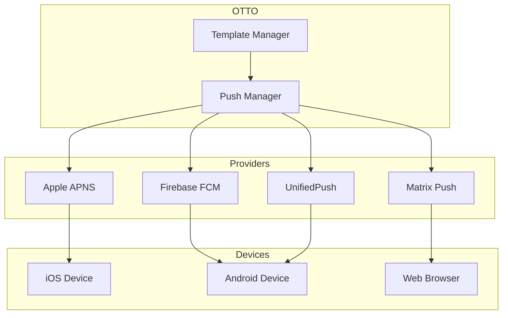

# Push Notifications API Reference

The OTTO Push Notification system provides multi-provider support for delivering real-time alerts to mobile devices.

## Overview



## Supported Providers

| Provider | Platform | Description |
|----------|----------|-------------|
| **APNS** | iOS | Apple Push Notification Service |
| **FCM** | Android/Web | Firebase Cloud Messaging |
| **Matrix** | All | Matrix Push Gateway (self-hosted) |
| **UnifiedPush** | Android | Privacy-focused alternative |

---

## Token Registration

### Register Push Token

```http
POST /api/v1/push/register
```

**Request:**

```json
{
  "device_id": "dev_abc123",
  "push_token": "fcm_token_or_apns_token",
  "provider": "fcm"
}
```

**Response:**

```json
{
  "success": true,
  "token_id": "tok_xyz789"
}
```

### Token Requirements

| Provider | Token Format |
|----------|--------------|
| APNS | 64-character hex string |
| FCM | 100+ character string |
| Matrix | Matrix room ID |
| UnifiedPush | Endpoint URL |

---

## Notification Categories

OTTO uses predefined notification categories with templates:

| Category | Priority | Description |
|----------|----------|-------------|
| `BURNOUT_WARNING` | High | Burnout level alerts |
| `ENERGY_ALERT` | High | Energy depletion warnings |
| `PROJECT_UPDATE` | Normal | Project status changes |
| `SECURITY_ALERT` | Critical | Security events |
| `COMMAND_RESULT` | Normal | Command execution results |
| `SYSTEM_STATUS` | Low | System status updates |

---

## Notification Templates

### Burnout Warning

```json
{
  "category": "BURNOUT_WARNING",
  "title": "Burnout Alert: {level}",
  "body": "{message}",
  "data": {
    "level": "YELLOW",
    "previous_level": "GREEN"
  }
}
```

### Energy Alert

```json
{
  "category": "ENERGY_ALERT",
  "title": "Energy: {level}",
  "body": "{message}",
  "data": {
    "energy_level": "depleted"
  }
}
```

### Security Alert

```json
{
  "category": "SECURITY_ALERT",
  "title": "Security Alert",
  "body": "{message}",
  "data": {
    "event_type": "unusual_activity"
  }
}
```

---

## Delivery Results

### Delivery Status

| Status | Description |
|--------|-------------|
| `pending` | Queued for delivery |
| `sent` | Sent to provider |
| `delivered` | Confirmed delivered |
| `failed` | Delivery failed |
| `expired` | Token expired |
| `invalid_token` | Token is invalid |

### Delivery Response

```json
{
  "token_id": "tok_xyz789",
  "status": "delivered",
  "provider": "apns",
  "delivered_at": "2024-01-15T12:00:00Z",
  "error": null
}
```

---

## REST API Endpoints

### Send Notification

```http
POST /api/v1/push/send
```

**Request:**

```json
{
  "user_ids": ["user123", "user456"],
  "category": "BURNOUT_WARNING",
  "level": "YELLOW",
  "message": "Consider taking a break"
}
```

**Response:**

```json
{
  "success": true,
  "results": [
    {
      "token_id": "tok_123",
      "status": "sent",
      "provider": "apns"
    },
    {
      "token_id": "tok_456",
      "status": "sent",
      "provider": "fcm"
    }
  ]
}
```

### Get Token Status

```http
GET /api/v1/push/tokens/{device_id}
```

**Response:**

```json
{
  "device_id": "dev_abc123",
  "tokens": [
    {
      "token_id": "tok_xyz",
      "provider": "apns",
      "registered_at": "2024-01-15T12:00:00Z",
      "last_used": "2024-01-15T12:30:00Z"
    }
  ]
}
```

### Unregister Token

```http
DELETE /api/v1/push/tokens/{token_id}
```

---

## Python SDK

```python
from otto.api.push import (
    PushNotificationManager,
    PushProvider,
    NotificationCategory,
    get_push_manager,
)

# Get singleton manager
manager = get_push_manager()

# Register a token
token = manager.register_token(
    token="apns_device_token_here",
    provider=PushProvider.APNS,
    device_id="dev_123",
    user_id="user_456"
)

# Send burnout warning
results = await manager.send_burnout_warning(
    user_id="user_456",
    level="YELLOW",
    message="Consider taking a break"
)

# Send using template
results = await manager.send_from_template(
    category=NotificationCategory.ENERGY_ALERT,
    user_ids=["user_456"],
    level="depleted",
    message="Energy critically low"
)

# Send security alert
results = await manager.send_security_alert(
    user_ids=["user_456", "user_789"],
    message="New device logged in from unknown location"
)

# Check delivery status
for result in results:
    print(f"{result.token_id}: {result.status.value}")
```

---

## Provider Configuration

### APNS (Apple)

```python
from otto.api.push import APNSProvider

provider = APNSProvider(
    key_id="YOUR_KEY_ID",
    team_id="YOUR_TEAM_ID",
    key_file="/path/to/AuthKey.p8",
    bundle_id="com.example.otto",
    production=True
)
```

### FCM (Firebase)

```python
from otto.api.push import FCMProvider

provider = FCMProvider(
    credentials_file="/path/to/firebase-credentials.json",
    project_id="your-firebase-project"
)
```

### Matrix Push Gateway

```python
from otto.api.push import MatrixProvider

provider = MatrixProvider(
    gateway_url="https://push.example.com",
    app_id="com.example.otto"
)
```

---

## iOS Integration

### Register for Push

```swift
import UserNotifications

UNUserNotificationCenter.current().requestAuthorization(options: [.alert, .badge, .sound]) { granted, error in
    if granted {
        DispatchQueue.main.async {
            UIApplication.shared.registerForRemoteNotifications()
        }
    }
}

func application(_ application: UIApplication, didRegisterForRemoteNotificationsWithDeviceToken deviceToken: Data) {
    let token = deviceToken.map { String(format: "%02.2hhx", $0) }.joined()
    // Send token to OTTO API
    OTTOClient.shared.registerPushToken(token, provider: "apns")
}
```

### Handle Notifications

```swift
extension AppDelegate: UNUserNotificationCenterDelegate {
    func userNotificationCenter(_ center: UNUserNotificationCenter, didReceive response: UNNotificationResponse) {
        let userInfo = response.notification.request.content.userInfo

        if let category = userInfo["category"] as? String {
            switch category {
            case "BURNOUT_WARNING":
                showBurnoutAlert(userInfo)
            case "SECURITY_ALERT":
                showSecurityAlert(userInfo)
            default:
                break
            }
        }
    }
}
```

---

## Android Integration

### Register for FCM

```kotlin
class OTTOFirebaseService : FirebaseMessagingService() {
    override fun onNewToken(token: String) {
        // Send token to OTTO API
        OTTOClient.registerPushToken(token, "fcm")
    }

    override fun onMessageReceived(message: RemoteMessage) {
        message.data["category"]?.let { category ->
            when (category) {
                "BURNOUT_WARNING" -> showBurnoutNotification(message)
                "SECURITY_ALERT" -> showSecurityNotification(message)
                else -> showGenericNotification(message)
            }
        }
    }
}
```

### Notification Channels

```kotlin
fun createNotificationChannels(context: Context) {
    val channels = listOf(
        NotificationChannel(
            "burnout",
            "Burnout Alerts",
            NotificationManager.IMPORTANCE_HIGH
        ),
        NotificationChannel(
            "security",
            "Security Alerts",
            NotificationManager.IMPORTANCE_MAX
        ),
        NotificationChannel(
            "system",
            "System Updates",
            NotificationManager.IMPORTANCE_DEFAULT
        )
    )

    val manager = context.getSystemService(NotificationManager::class.java)
    channels.forEach { manager.createNotificationChannel(it) }
}
```

---

## Rate Limits

| Category | Limit |
|----------|-------|
| Per user | 100/hour |
| Per device | 50/hour |
| Security alerts | 10/hour |
| Bulk sends | 1000/minute |

---

## See Also

- [Mobile API](mobile.md) - REST API reference
- [WebSocket API](websocket.md) - Real-time updates
- [WebAuthn](webauthn.md) - Biometric authentication
