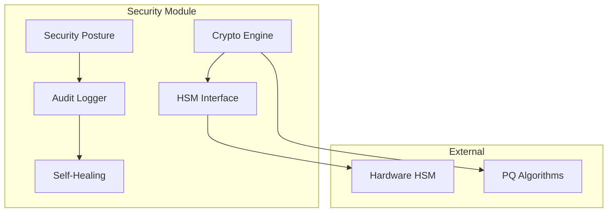

# Security API Reference

The OTTO Security module provides comprehensive security features including posture assessment, audit logging, HSM integration, and post-quantum cryptography.

## Overview



## Security Posture

### Get Security Posture

```http
GET /api/v1/security/posture
```

Assess current security posture across all components.

**Response:**

```json
{
  "status": "secure",
  "score": 95,
  "timestamp": "2024-01-15T12:00:00Z",
  "components": {
    "authentication": {
      "status": "strong",
      "details": {
        "mfa_enabled": true,
        "webauthn_available": true,
        "token_rotation": "enabled"
      }
    },
    "encryption": {
      "status": "strong",
      "details": {
        "algorithm": "AES-256-GCM",
        "key_rotation": "weekly",
        "pq_ready": true
      }
    },
    "audit": {
      "status": "enabled",
      "details": {
        "log_integrity": "verified",
        "retention_days": 90
      }
    },
    "network": {
      "status": "secure",
      "details": {
        "tls_version": "1.3",
        "certificate_valid": true
      }
    }
  },
  "recommendations": [],
  "last_assessment": "2024-01-15T11:55:00Z"
}
```

### Security Scores

| Score | Status | Description |
|-------|--------|-------------|
| 90-100 | Secure | All security controls active |
| 70-89 | Good | Minor improvements recommended |
| 50-69 | Fair | Several security gaps |
| 0-49 | At Risk | Critical security issues |

---

## Audit Logging

### Get Audit Logs

```http
GET /api/v1/security/audit
```

**Query Parameters:**

| Parameter | Type | Description |
|-----------|------|-------------|
| `start_time` | ISO8601 | Start of time range |
| `end_time` | ISO8601 | End of time range |
| `event_type` | string | Filter by event type |
| `user_id` | string | Filter by user |
| `limit` | integer | Max results (default: 100) |

**Response:**

```json
{
  "events": [
    {
      "id": "evt_abc123",
      "timestamp": "2024-01-15T12:00:00Z",
      "event_type": "auth.login",
      "user_id": "user_123",
      "ip_address": "192.168.1.100",
      "user_agent": "OTTO-iOS/1.0",
      "details": {
        "method": "webauthn",
        "success": true
      },
      "risk_score": 0.1
    }
  ],
  "pagination": {
    "total": 1000,
    "offset": 0,
    "limit": 100
  }
}
```

### Event Types

| Type | Description |
|------|-------------|
| `auth.login` | User login attempt |
| `auth.logout` | User logout |
| `auth.token_refresh` | Token refresh |
| `auth.mfa_challenge` | MFA challenge |
| `device.register` | Device registration |
| `device.verify` | Device verification |
| `security.posture_check` | Posture assessment |
| `security.key_rotation` | Key rotation event |
| `admin.config_change` | Configuration change |

---

## Cryptography

### Get Crypto Capabilities

```http
GET /api/v1/security/crypto
```

**Response:**

```json
{
  "classical": {
    "available": true,
    "algorithms": {
      "symmetric": ["AES-256-GCM", "ChaCha20-Poly1305"],
      "asymmetric": ["RSA-4096", "ECDSA-P256", "Ed25519"],
      "hash": ["SHA-256", "SHA-384", "SHA-512", "BLAKE3"]
    }
  },
  "post_quantum": {
    "available": true,
    "algorithms": {
      "kem": ["ML-KEM-768", "ML-KEM-1024"],
      "signature": ["ML-DSA-65", "ML-DSA-87", "SLH-DSA-SHA2-128f"]
    },
    "hybrid_mode": true
  },
  "hsm": {
    "available": true,
    "type": "PKCS#11",
    "slots": 4
  }
}
```

### Encrypt Data

```http
POST /api/v1/security/crypto/encrypt
```

**Request:**

```json
{
  "data": "base64_encoded_plaintext",
  "algorithm": "AES-256-GCM",
  "key_id": "key_abc123"
}
```

**Response:**

```json
{
  "ciphertext": "base64_encoded_ciphertext",
  "iv": "base64_encoded_iv",
  "tag": "base64_encoded_tag",
  "algorithm": "AES-256-GCM",
  "key_id": "key_abc123"
}
```

---

## HSM Integration

### List HSM Slots

```http
GET /api/v1/security/hsm/slots
```

**Response:**

```json
{
  "slots": [
    {
      "slot_id": 0,
      "label": "OTTO Primary",
      "manufacturer": "Thales",
      "model": "Luna Network HSM",
      "serial": "1234567890",
      "keys": 5
    }
  ]
}
```

### Generate Key in HSM

```http
POST /api/v1/security/hsm/keys
```

**Request:**

```json
{
  "slot_id": 0,
  "label": "api-signing-key",
  "algorithm": "ECDSA-P256",
  "extractable": false
}
```

**Response:**

```json
{
  "key_id": "hsm_key_abc123",
  "slot_id": 0,
  "label": "api-signing-key",
  "algorithm": "ECDSA-P256",
  "public_key": "base64_encoded_public_key",
  "created_at": "2024-01-15T12:00:00Z"
}
```

---

## Self-Healing

### Get Healing Status

```http
GET /api/v1/security/healing/status
```

**Response:**

```json
{
  "enabled": true,
  "last_scan": "2024-01-15T12:00:00Z",
  "issues_found": 0,
  "issues_remediated": 2,
  "pending_actions": [],
  "history": [
    {
      "timestamp": "2024-01-15T11:00:00Z",
      "issue": "expired_certificate",
      "action": "auto_renewed",
      "status": "resolved"
    }
  ]
}
```

### Trigger Security Scan

```http
POST /api/v1/security/healing/scan
```

**Response:**

```json
{
  "scan_id": "scan_xyz789",
  "status": "running",
  "started_at": "2024-01-15T12:00:00Z"
}
```

---

## Python SDK

```python
from otto.api.security import (
    SecurityPosture,
    AuditLogger,
    CryptoEngine,
    HSMInterface,
    SelfHealingSystem,
)

# Security Posture
posture = SecurityPosture()
report = await posture.assess()
print(f"Security Score: {report.score}/100")

# Audit Logging
logger = AuditLogger()
await logger.log_event(
    event_type="auth.login",
    user_id="user_123",
    details={"method": "webauthn", "success": True}
)

events = await logger.query(
    event_type="auth.*",
    start_time=datetime.now() - timedelta(days=7)
)

# Cryptography
crypto = CryptoEngine()
ciphertext = await crypto.encrypt(
    plaintext=b"sensitive data",
    algorithm="AES-256-GCM"
)

# Check PQ readiness
if crypto.pq_available:
    kem_result = await crypto.encapsulate(
        algorithm="ML-KEM-768",
        public_key=recipient_public_key
    )

# HSM Integration
hsm = HSMInterface()
key = await hsm.generate_key(
    slot=0,
    algorithm="ECDSA-P256",
    label="signing-key"
)
signature = await hsm.sign(key.key_id, data_hash)

# Self-Healing
healer = SelfHealingSystem()
await healer.enable()
issues = await healer.scan()
for issue in issues:
    await healer.remediate(issue)
```

---

## Security Invariants

The security module enforces these invariants:

| Invariant | Description |
|-----------|-------------|
| `key_never_exposed` | Private keys never leave HSM |
| `audit_immutable` | Audit logs are append-only |
| `token_rotation` | Tokens auto-rotate before expiry |
| `pq_hybrid` | PQ algorithms used in hybrid mode |
| `zero_trust` | All requests authenticated |

---

## [He2025] Compliance

Security operations maintain determinism:

```python
# Fixed algorithm selection at init
crypto = CryptoEngine(
    symmetric="AES-256-GCM",      # FIXED
    asymmetric="ECDSA-P256",      # FIXED
    pq_kem="ML-KEM-768",          # FIXED
    pq_sign="ML-DSA-65"           # FIXED
)

# Deterministic key derivation
key = crypto.derive_key(
    master_key=master,
    salt=fixed_salt,
    info=b"otto-session-key"
)
```

---

## Error Codes

| Code | Description |
|------|-------------|
| `HSM_UNAVAILABLE` | HSM not accessible |
| `KEY_NOT_FOUND` | Requested key doesn't exist |
| `ALGORITHM_UNSUPPORTED` | Algorithm not supported |
| `AUDIT_WRITE_FAILED` | Failed to write audit log |
| `POSTURE_CHECK_FAILED` | Security assessment failed |

---

## See Also

- [Security Checklist](../SECURITY_CHECKLIST.md) - Security best practices
- [[He2025] Compliance](../THINKINGMACHINES_COMPLIANCE.md) - Determinism compliance
- [Mobile API](mobile.md) - REST API reference
