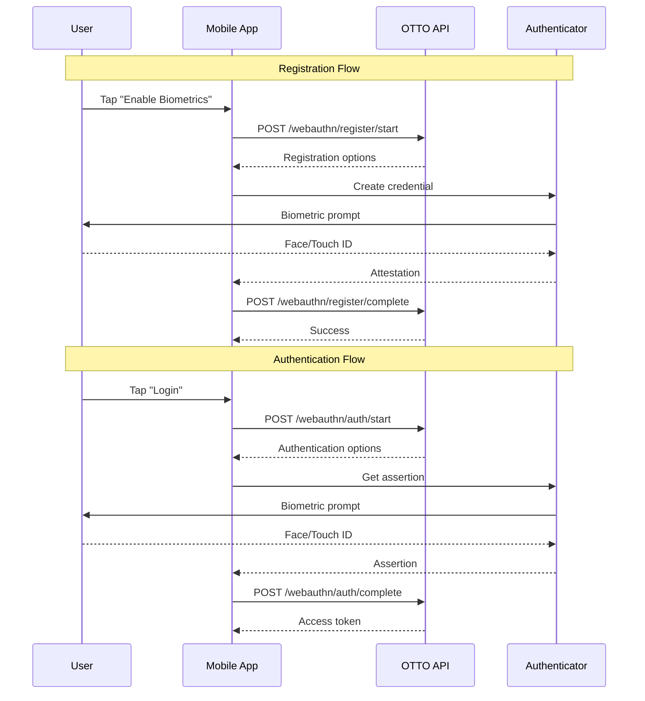

# WebAuthn API Reference

The OTTO WebAuthn API provides passwordless biometric authentication using FIDO2/WebAuthn standards.

## Overview

WebAuthn enables secure, passwordless authentication using:

- **Face ID** / **Touch ID** (iOS)
- **Fingerprint** / **Face Unlock** (Android)
- **Windows Hello**
- **Security Keys** (YubiKey, etc.)



## Endpoints

### Registration

#### Start Registration

```http
POST /api/v1/webauthn/register/start
```

Initiate WebAuthn credential registration.

**Request:**

```json
{
  "user_id": "user_123",
  "user_name": "user@example.com",
  "display_name": "John Doe"
}
```

**Response:**

```json
{
  "success": true,
  "options": {
    "challenge": "base64_encoded_challenge",
    "rp": {
      "name": "OTTO OS",
      "id": "otto-os.io"
    },
    "user": {
      "id": "base64_user_id",
      "name": "user@example.com",
      "displayName": "John Doe"
    },
    "pubKeyCredParams": [
      { "type": "public-key", "alg": -7 },
      { "type": "public-key", "alg": -257 }
    ],
    "timeout": 60000,
    "attestation": "none",
    "authenticatorSelection": {
      "authenticatorAttachment": "platform",
      "userVerification": "required",
      "residentKey": "preferred"
    }
  }
}
```

---

#### Complete Registration

```http
POST /api/v1/webauthn/register/complete
```

Complete credential registration with attestation.

**Request:**

```json
{
  "user_id": "user_123",
  "credential_id": "base64_credential_id",
  "attestation_object": "base64_attestation",
  "client_data_json": "base64_client_data"
}
```

**Response:**

```json
{
  "success": true,
  "credential": {
    "credential_id": "cred_abc123",
    "created_at": "2024-01-15T12:00:00Z",
    "last_used": null,
    "authenticator_type": "platform"
  }
}
```

---

### Authentication

#### Start Authentication

```http
POST /api/v1/webauthn/auth/start
```

Initiate WebAuthn authentication.

**Request:**

```json
{
  "user_id": "user_123"
}
```

Or for usernameless authentication:

```json
{}
```

**Response:**

```json
{
  "success": true,
  "options": {
    "challenge": "base64_encoded_challenge",
    "timeout": 60000,
    "rpId": "otto-os.io",
    "userVerification": "required",
    "allowCredentials": [
      {
        "type": "public-key",
        "id": "base64_credential_id",
        "transports": ["internal"]
      }
    ]
  }
}
```

---

#### Complete Authentication

```http
POST /api/v1/webauthn/auth/complete
```

Complete authentication with assertion.

**Request:**

```json
{
  "credential_id": "base64_credential_id",
  "authenticator_data": "base64_auth_data",
  "client_data_json": "base64_client_data",
  "signature": "base64_signature"
}
```

**Response:**

```json
{
  "success": true,
  "user_id": "user_123",
  "access_token": "eyJ...",
  "refresh_token": "eyJ..."
}
```

---

## Credential Management

### List Credentials

```http
GET /api/v1/webauthn/credentials
```

**Response:**

```json
{
  "credentials": [
    {
      "credential_id": "cred_abc123",
      "name": "iPhone Face ID",
      "created_at": "2024-01-15T12:00:00Z",
      "last_used": "2024-01-15T14:30:00Z",
      "authenticator_type": "platform"
    },
    {
      "credential_id": "cred_xyz789",
      "name": "YubiKey 5",
      "created_at": "2024-01-10T12:00:00Z",
      "last_used": "2024-01-14T09:00:00Z",
      "authenticator_type": "cross-platform"
    }
  ]
}
```

### Delete Credential

```http
DELETE /api/v1/webauthn/credentials/{credential_id}
```

---

## Authenticator Types

| Type | Description | Examples |
|------|-------------|----------|
| `platform` | Built-in device authenticator | Face ID, Touch ID, Windows Hello |
| `cross-platform` | External security key | YubiKey, Titan Key |

## Supported Algorithms

| Algorithm | COSE ID | Description |
|-----------|---------|-------------|
| ES256 | -7 | ECDSA with P-256 and SHA-256 |
| RS256 | -257 | RSASSA-PKCS1-v1_5 with SHA-256 |
| EdDSA | -8 | EdDSA (Ed25519) |

---

## Python SDK

```python
from otto.api.webauthn import WebAuthnAPI, get_webauthn_api

# Get singleton API
api = get_webauthn_api()

# Configure (once at startup)
api = WebAuthnAPI(
    rp_id="otto-os.io",
    rp_name="OTTO OS"
)

# Start registration
result = await api.start_registration(
    user_id="user_123",
    user_name="user@example.com",
    display_name="John Doe"
)
options = result["options"]

# Client creates credential, then complete:
result = await api.complete_registration(
    user_id="user_123",
    credential_id=attestation.credential_id,
    attestation_object=attestation.attestation_object,
    client_data_json=attestation.client_data_json
)

# Start authentication
result = await api.start_authentication(user_id="user_123")
options = result["options"]

# Client gets assertion, then complete:
result = await api.complete_authentication(
    credential_id=assertion.credential_id,
    authenticator_data=assertion.authenticator_data,
    client_data_json=assertion.client_data_json,
    signature=assertion.signature
)

access_token = result["access_token"]
```

---

## iOS Integration

### Registration

```swift
import AuthenticationServices

class WebAuthnManager: NSObject, ASAuthorizationControllerDelegate {

    func startRegistration(options: RegistrationOptions) {
        let provider = ASAuthorizationPlatformPublicKeyCredentialProvider(
            relyingPartyIdentifier: options.rpId
        )

        let request = provider.createCredentialRegistrationRequest(
            challenge: Data(base64Encoded: options.challenge)!,
            name: options.userName,
            userID: Data(options.userId.utf8)
        )

        let controller = ASAuthorizationController(authorizationRequests: [request])
        controller.delegate = self
        controller.performRequests()
    }

    func authorizationController(
        controller: ASAuthorizationController,
        didCompleteWithAuthorization authorization: ASAuthorization
    ) {
        guard let credential = authorization.credential as?
            ASAuthorizationPlatformPublicKeyCredentialRegistration else { return }

        // Send to server
        OTTOClient.shared.completeRegistration(
            credentialId: credential.credentialID.base64EncodedString(),
            attestationObject: credential.rawAttestationObject!.base64EncodedString(),
            clientDataJSON: credential.rawClientDataJSON.base64EncodedString()
        )
    }
}
```

### Authentication

```swift
func startAuthentication(options: AuthenticationOptions) {
    let provider = ASAuthorizationPlatformPublicKeyCredentialProvider(
        relyingPartyIdentifier: options.rpId
    )

    let request = provider.createCredentialAssertionRequest(
        challenge: Data(base64Encoded: options.challenge)!
    )

    let controller = ASAuthorizationController(authorizationRequests: [request])
    controller.delegate = self
    controller.performRequests()
}
```

---

## Android Integration

### Registration

```kotlin
import androidx.credentials.*

class WebAuthnManager(private val context: Context) {
    private val credentialManager = CredentialManager.create(context)

    suspend fun startRegistration(options: RegistrationOptions) {
        val request = CreatePublicKeyCredentialRequest(
            requestJson = options.toJson()
        )

        val result = credentialManager.createCredential(
            context = context as Activity,
            request = request
        )

        when (result) {
            is CreatePublicKeyCredentialResponse -> {
                // Send to server
                OTTOClient.completeRegistration(result.registrationResponseJson)
            }
        }
    }

    suspend fun startAuthentication(options: AuthenticationOptions) {
        val request = GetCredentialRequest(
            listOf(GetPublicKeyCredentialOption(options.toJson()))
        )

        val result = credentialManager.getCredential(
            context = context as Activity,
            request = request
        )

        when (val credential = result.credential) {
            is PublicKeyCredential -> {
                OTTOClient.completeAuthentication(credential.authenticationResponseJson)
            }
        }
    }
}
```

---

## Web Integration

### Registration

```javascript
async function registerWebAuthn(options) {
  const publicKeyOptions = {
    challenge: base64ToBuffer(options.challenge),
    rp: options.rp,
    user: {
      id: base64ToBuffer(options.user.id),
      name: options.user.name,
      displayName: options.user.displayName
    },
    pubKeyCredParams: options.pubKeyCredParams,
    timeout: options.timeout,
    attestation: options.attestation,
    authenticatorSelection: options.authenticatorSelection
  };

  const credential = await navigator.credentials.create({
    publicKey: publicKeyOptions
  });

  // Send to server
  await fetch('/api/v1/webauthn/register/complete', {
    method: 'POST',
    body: JSON.stringify({
      credential_id: bufferToBase64(credential.rawId),
      attestation_object: bufferToBase64(credential.response.attestationObject),
      client_data_json: bufferToBase64(credential.response.clientDataJSON)
    })
  });
}
```

### Authentication

```javascript
async function authenticateWebAuthn(options) {
  const publicKeyOptions = {
    challenge: base64ToBuffer(options.challenge),
    timeout: options.timeout,
    rpId: options.rpId,
    userVerification: options.userVerification,
    allowCredentials: options.allowCredentials?.map(cred => ({
      type: cred.type,
      id: base64ToBuffer(cred.id),
      transports: cred.transports
    }))
  };

  const assertion = await navigator.credentials.get({
    publicKey: publicKeyOptions
  });

  // Send to server
  const response = await fetch('/api/v1/webauthn/auth/complete', {
    method: 'POST',
    body: JSON.stringify({
      credential_id: bufferToBase64(assertion.rawId),
      authenticator_data: bufferToBase64(assertion.response.authenticatorData),
      client_data_json: bufferToBase64(assertion.response.clientDataJSON),
      signature: bufferToBase64(assertion.response.signature)
    })
  });

  return response.json();
}
```

---

## Security Considerations

### Challenge Expiration

Challenges expire after **60 seconds**. Generate a new challenge for each authentication attempt.

### Credential Storage

- Store only the public key, never private keys
- Credential IDs are safe to store in databases
- Sign count should be verified to detect cloned authenticators

### User Verification

Always require user verification (`userVerification: "required"`) for sensitive operations.

---

## Error Codes

| Code | Description |
|------|-------------|
| `CHALLENGE_EXPIRED` | Challenge has expired |
| `CREDENTIAL_NOT_FOUND` | Credential not registered |
| `SIGNATURE_INVALID` | Signature verification failed |
| `USER_NOT_FOUND` | User not registered |
| `ATTESTATION_INVALID` | Attestation verification failed |

---

## See Also

- [Mobile API](mobile.md) - REST API reference
- [WebSocket API](websocket.md) - Real-time updates
- [Push Notifications](push.md) - Push notification setup
