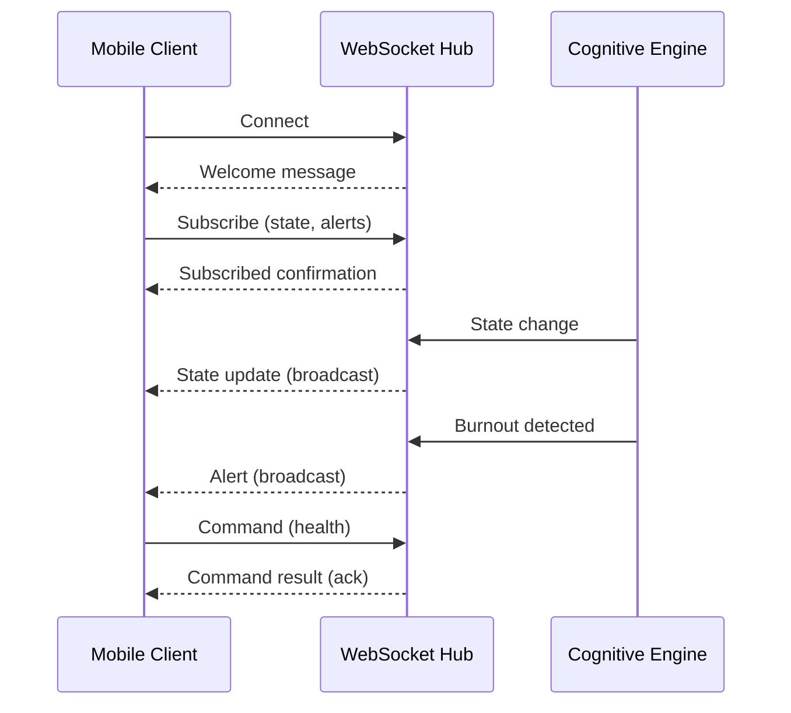

# WebSocket API Reference

The OTTO WebSocket API provides real-time bidirectional communication for instant state updates, alerts, and commands.

## Overview



## Connection

### Endpoint

```
wss://api.otto-os.io/ws
```

### Authentication

Include the access token as a query parameter or in the first message:

```javascript
// Query parameter
const ws = new WebSocket('wss://api.otto-os.io/ws?token=<access_token>');

// Or first message
ws.send(JSON.stringify({
  type: 'auth',
  data: { token: '<access_token>' }
}));
```

---

## Message Format

All messages follow this structure:

```json
{
  "type": "message_type",
  "id": "unique_message_id",
  "channel": "channel_name",
  "data": {},
  "timestamp": 1705320000.0
}
```

| Field | Type | Required | Description |
|-------|------|----------|-------------|
| `type` | string | Yes | Message type |
| `id` | string | No | Unique message ID (for ack) |
| `channel` | string | No | Target channel |
| `data` | object | No | Message payload |
| `timestamp` | float | No | Unix timestamp |

---

## Message Types

### Client → Server

| Type | Description |
|------|-------------|
| `auth` | Authenticate connection |
| `subscribe` | Subscribe to channels |
| `unsubscribe` | Unsubscribe from channels |
| `ping` | Keep-alive ping |
| `command` | Execute command |

### Server → Client

| Type | Description |
|------|-------------|
| `welcome` | Connection established |
| `subscribed` | Subscription confirmed |
| `unsubscribed` | Unsubscription confirmed |
| `pong` | Ping response |
| `ack` | Command acknowledgment |
| `state_update` | Cognitive state changed |
| `alert` | Alert notification |
| `error` | Error occurred |

---

## Channels

| Channel | Description |
|---------|-------------|
| `state` | Cognitive state updates |
| `alerts` | Burnout/energy alerts |
| `projects` | Project status changes |
| `security` | Security events |
| `commands` | Command results |
| `all` | All channels (wildcard) |

---

## Client Messages

### Subscribe

```json
{
  "type": "subscribe",
  "data": {
    "channels": ["state", "alerts"]
  }
}
```

### Unsubscribe

```json
{
  "type": "unsubscribe",
  "data": {
    "channels": ["projects"]
  }
}
```

### Ping

```json
{
  "type": "ping",
  "id": "ping_123"
}
```

### Command

```json
{
  "type": "command",
  "id": "cmd_456",
  "data": {
    "command": "health"
  }
}
```

---

## Server Messages

### Welcome

Sent immediately after connection:

```json
{
  "type": "welcome",
  "data": {
    "connection_id": "conn_abc123",
    "server_time": 1705320000.0,
    "version": "1.0.0"
  }
}
```

### State Update

Broadcast when cognitive state changes:

```json
{
  "type": "state_update",
  "channel": "state",
  "data": {
    "active_mode": "focused",
    "burnout_level": "GREEN",
    "energy_level": "high",
    "momentum_phase": "rolling",
    "_changes": ["burnout_level", "momentum_phase"]
  },
  "timestamp": 1705320000.0
}
```

### Alert

Broadcast when an alert is triggered:

```json
{
  "type": "alert",
  "channel": "alerts",
  "data": {
    "severity": "warning",
    "title": "Burnout Warning",
    "message": "Burnout level elevated to YELLOW",
    "source": "burnout_monitor",
    "data": {
      "previous": "GREEN",
      "current": "YELLOW"
    }
  },
  "timestamp": 1705320000.0
}
```

### Alert Severity Levels

| Severity | Description |
|----------|-------------|
| `info` | Informational message |
| `warning` | Warning condition |
| `critical` | Critical alert (RED burnout) |
| `error` | System error |

### Command Ack

Response to a command:

```json
{
  "type": "ack",
  "id": "cmd_456",
  "data": {
    "success": true,
    "result": {
      "status": "healthy",
      "uptime": 3600
    }
  },
  "timestamp": 1705320000.0
}
```

### Error

```json
{
  "type": "error",
  "id": "cmd_456",
  "data": {
    "code": "INVALID_COMMAND",
    "message": "Unknown command: foo"
  },
  "timestamp": 1705320000.0
}
```

---

## State Change Monitor

The WebSocket hub includes an automatic state change monitor that:

1. **Detects burnout changes** - Alerts when burnout level worsens
2. **Detects energy depletion** - Alerts when energy becomes depleted
3. **Broadcasts state updates** - Notifies subscribers of any state change

### Burnout Alerts

| Transition | Severity | Message |
|------------|----------|---------|
| GREEN → YELLOW | warning | "Burnout level elevated" |
| YELLOW → ORANGE | warning | "Burnout level elevated" |
| ORANGE → RED | critical | "Critical burnout level reached" |
| * → GREEN | info | "Burnout level improved" (no alert) |

### Energy Alerts

| Transition | Severity | Message |
|------------|----------|---------|
| * → depleted | critical | "Energy depleted" |

---

## JavaScript Client Example

```javascript
class OTTOWebSocket {
  constructor(token) {
    this.token = token;
    this.ws = null;
    this.handlers = {};
  }

  connect() {
    this.ws = new WebSocket(`wss://api.otto-os.io/ws?token=${this.token}`);

    this.ws.onmessage = (event) => {
      const message = JSON.parse(event.data);
      this.handleMessage(message);
    };

    this.ws.onopen = () => {
      // Subscribe to channels
      this.subscribe(['state', 'alerts']);
    };
  }

  subscribe(channels) {
    this.ws.send(JSON.stringify({
      type: 'subscribe',
      data: { channels }
    }));
  }

  handleMessage(message) {
    const handler = this.handlers[message.type];
    if (handler) {
      handler(message);
    }
  }

  on(type, handler) {
    this.handlers[type] = handler;
  }

  command(cmd) {
    const id = `cmd_${Date.now()}`;
    this.ws.send(JSON.stringify({
      type: 'command',
      id,
      data: { command: cmd }
    }));
    return id;
  }
}

// Usage
const otto = new OTTOWebSocket('access_token_here');

otto.on('state_update', (msg) => {
  console.log('State changed:', msg.data);
});

otto.on('alert', (msg) => {
  if (msg.data.severity === 'critical') {
    showNotification(msg.data.title, msg.data.message);
  }
});

otto.connect();
```

---

## Python Client Example

```python
import asyncio
import json
from otto.api.websocket import (
    WebSocketHub,
    Channel,
    StateChangeMonitor,
    get_websocket_hub,
)

# Server-side usage
hub = get_websocket_hub()

# Register a connection
def send_callback(message: str):
    # Send to actual WebSocket connection
    pass

conn = hub.register("conn_123", send_callback)
conn.subscribe(Channel.STATE)
conn.subscribe(Channel.ALERTS)

# Broadcast state update
await hub.broadcast_state_update({
    "active_mode": "focused",
    "burnout_level": "GREEN"
})

# Use state monitor
monitor = StateChangeMonitor(hub)
await monitor.check_state({"burnout_level": "YELLOW"})  # Triggers alert
```

---

## Connection Management

### Heartbeat

Send a `ping` message every 30 seconds to keep the connection alive:

```javascript
setInterval(() => {
  ws.send(JSON.stringify({ type: 'ping', id: 'ping_' + Date.now() }));
}, 30000);
```

### Reconnection

Implement exponential backoff for reconnection:

```javascript
function reconnect(attempt = 1) {
  const delay = Math.min(1000 * Math.pow(2, attempt), 30000);
  setTimeout(() => {
    connect().catch(() => reconnect(attempt + 1));
  }, delay);
}
```

---

## See Also

- [Mobile API](mobile.md) - REST API reference
- [Push Notifications](push.md) - Push notification setup
- [WebAuthn](webauthn.md) - Biometric authentication
