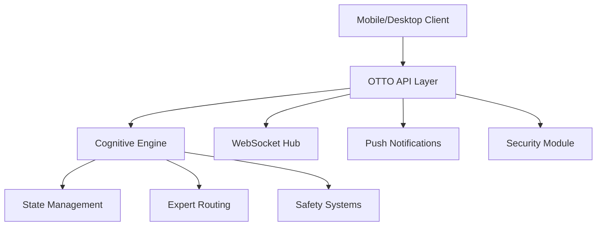

# OTTO OS

<div align="center">

**Cognitive Operating System for ADHD-Native AI Assistance**

[](https://github.com/JosephOIbrahim/OTTO_OS)
[](https://github.com/JosephOIbrahim/OTTO_OS)
[](https://www.python.org)
[](LICENSE)

</div>

---

## What is OTTO?

OTTO is a **cognitive operating system** designed to provide intelligent, context-aware assistance while respecting neurodivergent needs. Built on the [He2025] determinism principles, OTTO ensures predictable, reproducible behavior across all interactions.



## Key Features

<div class="grid cards" markdown>

-   :material-brain:{ .lg .middle } **Cognitive State Tracking**

    ---

    Real-time monitoring of burnout levels, energy states, and momentum phases with automatic intervention routing.

    [:octicons-arrow-right-24: Learn more](ARCHITECTURE.md)

-   :material-shield-check:{ .lg .middle } **[He2025] Compliant**

    ---

    Deterministic behavior guaranteed through fixed evaluation order, locked parameters, and reproducible outputs.

    [:octicons-arrow-right-24: Compliance details](THINKINGMACHINES_COMPLIANCE.md)

-   :material-cellphone:{ .lg .middle } **Mobile-First API**

    ---

    Full-featured REST API with WebSocket real-time updates, push notifications, and biometric authentication.

    [:octicons-arrow-right-24: API Reference](API.md)

-   :material-lock:{ .lg .middle } **Security-First Design**

    ---

    Post-quantum ready cryptography, HSM support, and comprehensive audit logging.

    [:octicons-arrow-right-24: Security Guide](SECURITY_CHECKLIST.md)

</div>

## Quick Start

=== "pip"

    ```bash
    pip install otto-os
    otto serve --port 8080
    ```

=== "Docker"

    ```bash
    docker pull ghcr.io/josephoibrahim/otto-os:latest
    docker run -p 8080:8080 ghcr.io/josephoibrahim/otto-os:latest
    ```

=== "From Source"

    ```bash
    git clone https://github.com/JosephOIbrahim/OTTO_OS.git
    cd OTTO_OS
    pip install -e ".[dev]"
    otto serve
    ```

## Architecture Overview

OTTO follows a layered architecture with clear separation of concerns:

| Layer | Purpose | Key Components |
|-------|---------|----------------|
| **API Layer** | External interfaces | REST, WebSocket, gRPC |
| **Cognitive Engine** | Decision making | Expert routing, state detection |
| **Safety Systems** | Protection | Burnout detection, anti-spiral |
| **State Management** | Persistence | Session state, EWM |
| **Security Module** | Protection | Auth, audit, cryptography |

## Mobile Infrastructure

OTTO provides comprehensive mobile support:

- **Mobile REST API** - Full-featured API for iOS/Android/Web
- **WebSocket Hub** - Real-time bidirectional communication
- **Push Notifications** - Multi-provider support (APNS, FCM, Matrix)
- **WebAuthn** - Passwordless biometric authentication
- **PWA Dashboard** - Installable web application

## Test Coverage

```
================================ test session starts ================================
platform win32 -- Python 3.11.0
collected 3044 items

tests/                                                                    [100%]

================================ 3044 passed in 45.23s ==============================
```

## Documentation Sections

| Section | Description |
|---------|-------------|
| [Getting Started](QUICKSTART.md) | Installation and first steps |
| [Architecture](ARCHITECTURE.md) | System design and components |
| [API Reference](API.md) | Complete API documentation |
| [Security](SECURITY_CHECKLIST.md) | Security features and configuration |
| [Integration](INTEGRATION_GUIDE.md) | Third-party integrations |

## Contributing

We welcome contributions! See our [Contributing Guide](development/contributing.md) for details.

## License

OTTO OS is released under the MIT License. See [LICENSE](https://github.com/JosephOIbrahim/OTTO_OS/blob/master/LICENSE) for details.
