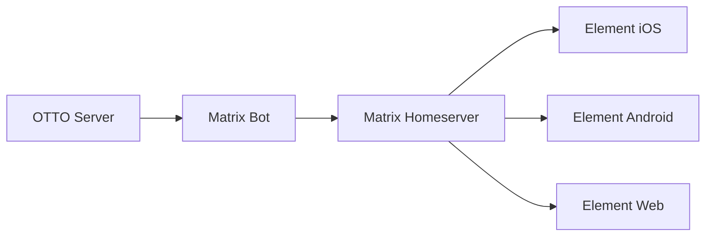

# Matrix Bot Integration

OTTO provides a Matrix bot for receiving notifications and interacting with your cognitive assistant through the Matrix protocol.

## Overview

The OTTO Matrix bot enables:

- **Push Notifications** via Matrix rooms
- **Command Execution** through chat messages
- **State Monitoring** with real-time updates
- **Multi-Device Sync** across Matrix clients



## Setup

### 1. Create Bot Account

Create a Matrix account for your bot on your homeserver:

```bash
# Using the Matrix admin API
curl -X POST "https://matrix.example.com/_synapse/admin/v1/register" \
  -H "Authorization: Bearer $ADMIN_TOKEN" \
  -d '{
    "username": "otto-bot",
    "password": "secure-password",
    "admin": false
  }'
```

### 2. Configure OTTO

Add Matrix configuration to `~/.otto/config.yaml`:

```yaml
matrix:
  enabled: true
  homeserver: https://matrix.example.com
  user_id: "@otto-bot:example.com"
  access_token: "${MATRIX_ACCESS_TOKEN}"
  device_id: "OTTO_BOT"

  # Room for notifications
  notification_room: "!room_id:example.com"

  # Command prefix
  command_prefix: "!otto"

  # Features
  features:
    push_notifications: true
    commands: true
    state_updates: true
```

### 3. Start the Bot

```bash
otto matrix start
```

---

## Bot Commands

Interact with OTTO through Matrix messages:

| Command | Description |
|---------|-------------|
| `!otto health` | Check system health |
| `!otto state` | Show cognitive state |
| `!otto projects` | List active projects |
| `!otto burnout` | Check burnout level |
| `!otto help` | Show help |

### Example Conversation

```
You: !otto state

OTTO Bot: Current Cognitive State
- Mode: focused
- Burnout: GREEN
- Energy: high
- Momentum: rolling
- Altitude: 15,000ft

You: !otto projects

OTTO Bot: Active Projects
- [FOCUS] OTTO OS
- [HOLDING] Portfolio
- [BACKGROUND] Research
```

---

## Push Notifications

### Configure Matrix Push

```python
from otto.api.push import PushNotificationManager, PushProvider

manager = PushNotificationManager()

# Register Matrix push token
manager.register_token(
    token="!room_id:example.com",
    provider=PushProvider.MATRIX,
    device_id="matrix_client",
    user_id="user_123"
)
```

### Notification Format

Matrix notifications appear as formatted messages:

```
Burnout Alert

Level: YELLOW to ORANGE

Consider taking a break. Your burnout level
has elevated. Suggested actions:
- Step away for 15 minutes
- Switch to easier tasks
- End the session

Sent by OTTO at 2024-01-15 12:00 UTC
```

---

## Room Configuration

### Private Room (Recommended)

Create a private room for notifications:

```bash
# Using Element
1. Create new room
2. Set to "Private"
3. Invite @otto-bot:example.com
4. Copy room ID (!xxxx:example.com)
```

### Encryption

The bot supports end-to-end encryption:

```yaml
matrix:
  encryption:
    enabled: true
    device_id: "OTTO_BOT"
    session_key: "${MATRIX_SESSION_KEY}"
```

---

## Python SDK

```python
from otto.integrations.matrix import MatrixBot

# Initialize bot
bot = MatrixBot(
    homeserver="https://matrix.example.com",
    user_id="@otto-bot:example.com",
    access_token="access_token_here"
)

# Send notification
await bot.send_notification(
    room_id="!room_id:example.com",
    title="Task Complete",
    message="Your build finished successfully"
)

# Handle commands
@bot.command("status")
async def status_command(room, event):
    state = await otto.get_cognitive_state()
    await bot.send_message(room.room_id, format_state(state))

# Start bot
await bot.run()
```

---

## Docker Deployment

```yaml
# docker-compose.yml
version: '3.8'
services:
  otto:
    image: ghcr.io/josephoibrahim/otto-os:latest
    environment:
      - MATRIX_ENABLED=true
      - MATRIX_HOMESERVER=https://matrix.example.com
      - MATRIX_USER_ID=@otto-bot:example.com
      - MATRIX_ACCESS_TOKEN=${MATRIX_ACCESS_TOKEN}

  synapse:
    image: matrixdotorg/synapse:latest
    volumes:
      - synapse-data:/data
```

---

## Security

### Best Practices

1. **Use a dedicated bot account** - Don't use personal credentials
2. **Enable E2E encryption** - For sensitive notifications
3. **Restrict room access** - Private rooms only
4. **Rotate access tokens** - Regularly rotate bot tokens
5. **Monitor bot activity** - Audit command usage

### Access Token Rotation

```bash
# Rotate Matrix access token
otto matrix rotate-token

# Verify new token
otto matrix verify
```

---

## Troubleshooting

### Bot Not Responding

```bash
# Check bot status
otto matrix status

# View logs
otto matrix logs --tail 100

# Restart bot
otto matrix restart
```

### Connection Issues

```bash
# Test homeserver connection
curl https://matrix.example.com/_matrix/client/versions

# Verify credentials
otto matrix verify
```

---

## See Also

- [Push Notifications](../api/push.md) - Push API reference
- [Configuration](../CONFIGURATION.md) - Full configuration
- [PWA Dashboard](pwa.md) - Web dashboard
